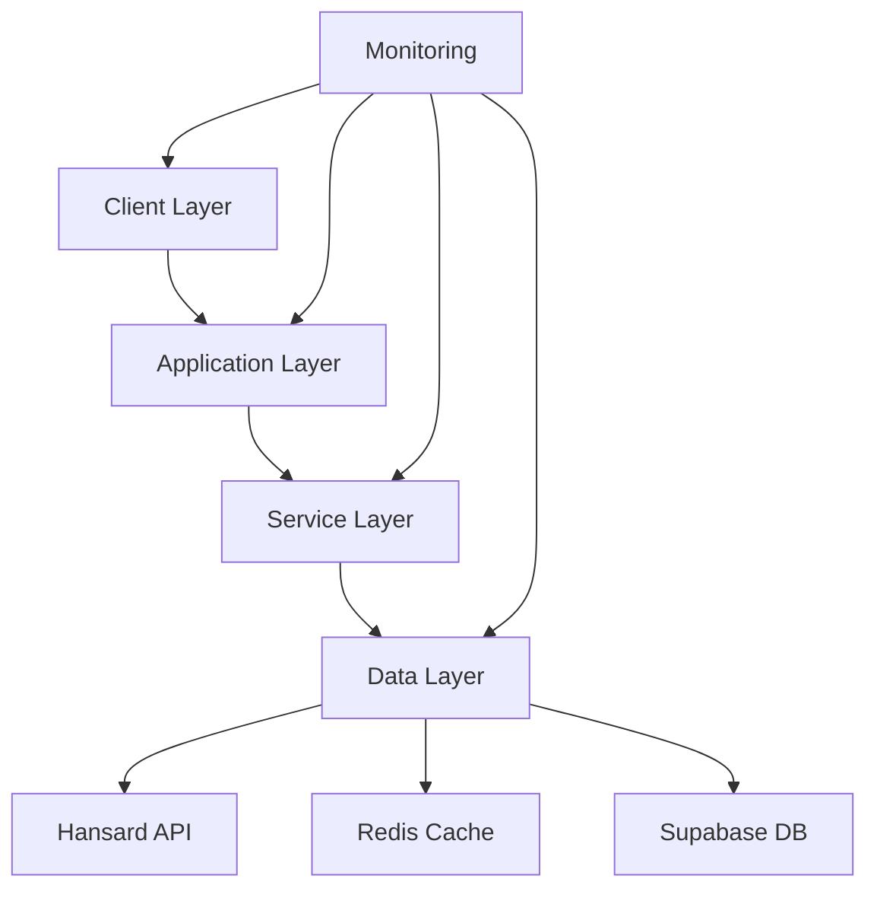
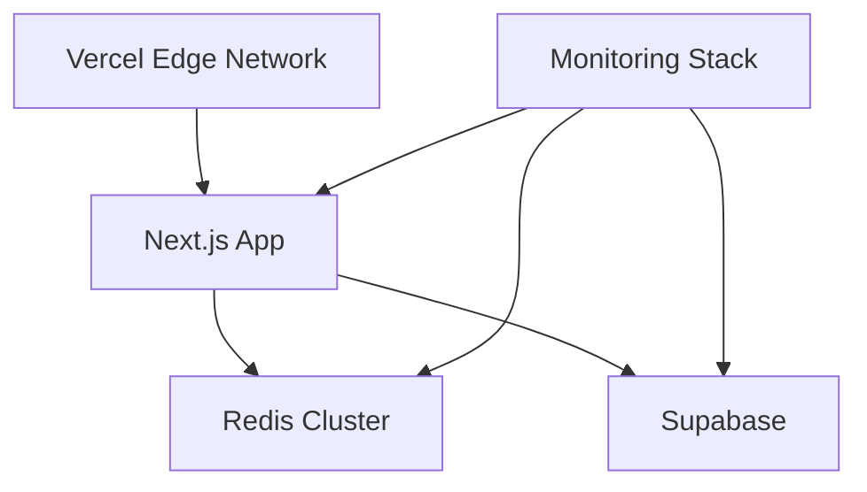
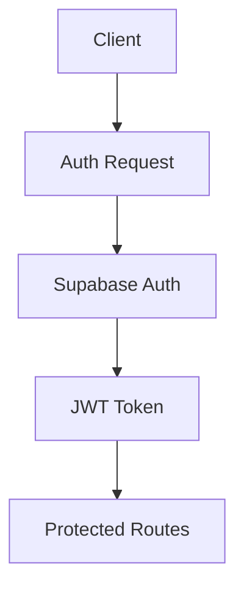

# Parliamentary Debates AI Assistant - Complete Architecture

## System Architecture

### High-Level Overview


### Layer Details

#### 1. Client Layer
```typescript
// Architecture Components
- Next.js 14 App Router
- React Server Components
- Client-side Components
- Streaming SSR

// Data Flow
Client Request → Edge Runtime → Server Components → Client Hydration
```

#### 2. Application Layer
```typescript
// Core Components
- tRPC Routers
- Rate Limiting
- Auth Middleware
- Request Validation

// Request Flow
Request → Rate Limit Check → Auth → Validation → Router → Service
```

#### 3. Service Layer
```typescript
// Service Architecture
- Domain Services
- Data Access Layer
- Cache Management
- Error Handling

// Data Flow
Service → Cache Check → API/DB Fetch → Cache Update → Response
```

#### 4. Data Layer
```typescript
// Components
- Redis Cache
- Supabase Database
- Hansard API Client
- Data Transformers
```

## Detailed Implementation Architecture

### 1. API Layer (tRPC)
```typescript
// src/server/trpc/router.ts
import { initTRPC } from '@trpc/server';
import { z } from 'zod';
import { redis } from '../redis';
import { rateLimit } from '../middleware/rate-limit';

// Initialize tRPC
const t = initTRPC.create();

// Middleware
const isAuthed = t.middleware(async ({ ctx, next }) => {
  if (!ctx.session) throw new TRPCError({ code: 'UNAUTHORIZED' });
  return next({ ctx: { session: ctx.session } });
});

// Procedures
const publicProcedure = t.procedure.use(rateLimit);
const protectedProcedure = publicProcedure.use(isAuthed);

// Router Definition
export const appRouter = t.router({
  debates: t.router({
    list: publicProcedure
      .input(z.object({
        skip: z.number(),
        take: z.number(),
        filters: z.object({
          searchTerm: z.string().optional(),
          dateRange: z.object({
            start: z.string(),
            end: z.string()
          }).optional(),
          category: z.string().optional()
        })
      }))
      .query(async ({ input }) => {
        // Implementation
      }),
    
    getById: publicProcedure
      .input(z.string())
      .query(async ({ input }) => {
        // Implementation
      }),
  }),
});
```

### 2. Caching Architecture
```typescript
// src/server/cache/index.ts
import { Redis } from 'ioredis';
import { Debate } from '@/types';

interface CacheConfig {
  ttl: number;
  prefix: string;
}

export class CacheManager {
  private redis: Redis;
  private config: CacheConfig;

  constructor(redis: Redis, config: CacheConfig) {
    this.redis = redis;
    this.config = config;
  }

  private getKey(key: string): string {
    return `${this.config.prefix}:${key}`;
  }

  async get<T>(key: string): Promise<T | null> {
    const data = await this.redis.get(this.getKey(key));
    return data ? JSON.parse(data) : null;
  }

  async set(key: string, value: any): Promise<void> {
    await this.redis.setex(
      this.getKey(key),
      this.config.ttl,
      JSON.stringify(value)
    );
  }

  async invalidate(key: string): Promise<void> {
    await this.redis.del(this.getKey(key));
  }
}

// Cache Implementations
export const debateCache = new CacheManager(redis, {
  ttl: 300, // 5 minutes
  prefix: 'debate'
});

export const searchCache = new CacheManager(redis, {
  ttl: 60,  // 1 minute
  prefix: 'search'
});
```

### 3. Data Access Layer
```typescript
// src/server/data/debates.ts
import { HansardAPI } from './hansard';
import { supabase } from './supabase';
import { debateCache } from '../cache';
import { DebateMapper } from '../mappers';

export class DebateService {
  private hansardApi: HansardAPI;
  private cache: CacheManager;
  private mapper: DebateMapper;

  async getDebate(id: string) {
    // Try cache
    const cached = await this.cache.get(id);
    if (cached) return cached;

    // Fetch from Hansard
    const [debate, speakers] = await Promise.all([
      this.hansardApi.fetchDebate(id),
      this.hansardApi.fetchSpeakers(id)
    ]);

    // Get AI content
    const aiContent = await this.getAIContent(id);

    // Map and cache
    const mappedDebate = this.mapper.toDebateDTO(debate, speakers, aiContent);
    await this.cache.set(id, mappedDebate);

    return mappedDebate;
  }

  private async getAIContent(debateId: string) {
    const { data } = await supabase
      .from('debate_generated_content')
      .select()
      .eq('debate_id', debateId);
    return data;
  }
}
```

### 4. State Management
```typescript
// src/state/index.ts
import { atom } from 'jotai';
import { atomWithQuery } from 'jotai/query';

// Atoms
export const filterAtom = atom({
  searchTerm: '',
  dateRange: null,
  category: 'all'
});

export const debateListAtom = atomWithQuery((get) => ({
  queryKey: ['debates', get(filterAtom)],
  queryFn: async ({ queryKey: [_, filters] }) => {
    // Implementation
  },
}));

// Derived atoms
export const filteredDebatesAtom = atom((get) => {
  const debates = get(debateListAtom);
  const filters = get(filterAtom);
  // Apply filters
});
```

### 5. Error Handling Architecture
```typescript
// src/lib/error/index.ts
import * as Sentry from '@sentry/nextjs';

export class ErrorManager {
  static initialize() {
    Sentry.init({
      dsn: process.env.SENTRY_DSN,
      tracesSampleRate: 0.1,
      beforeSend(event) {
        if (process.env.NODE_ENV === 'development') {
          console.error(event);
          return null;
        }
        return event;
      },
    });
  }

  static captureError(error: Error, context?: any) {
    Sentry.withScope((scope) => {
      if (context) {
        scope.setContext('additional', context);
      }
      Sentry.captureException(error);
    });
  }
}

// Error boundaries
export class AppErrorBoundary extends React.Component {
  static getDerivedStateFromError(error: Error) {
    ErrorManager.captureError(error);
    return { hasError: true };
  }
}
```

### 6. Monitoring Architecture
```typescript
// src/lib/monitoring/index.ts
import { NodeSDK } from '@opentelemetry/sdk-node';
import { Resource } from '@opentelemetry/resources';

export class Monitoring {
  private static instance: NodeSDK;

  static initialize() {
    if (!this.instance) {
      this.instance = new NodeSDK({
        resource: new Resource({
          'service.name': 'parliamentary-debates',
          'deployment.environment': process.env.NODE_ENV
        }),
        spanProcessor: this.createSpanProcessor(),
        instrumentations: this.getInstrumentations()
      });
    }
    return this.instance;
  }

  static createMetricsExporter() {
    // Implementation
  }

  static createSpanProcessor() {
    // Implementation
  }
}
```

### 7. Infrastructure Configuration
```yaml
# docker-compose.yml
version: '3.8'
services:
  redis:
    image: redis:6.2-alpine
    ports:
      - "6379:6379"
    command: redis-server --save 20 1 --loglevel warning
    volumes: 
      - redis-data:/data
    configs:
      - source: redis_config
        target: /usr/local/etc/redis/redis.conf

  app:
    build: .
    depends_on:
      - redis
    environment:
      - REDIS_URL=redis://redis:6379
      - NODE_ENV=production

configs:
  redis_config:
    file: ./redis.conf

volumes:
  redis-data:
```

### 8. Deployment Architecture


## Performance Optimizations

### 1. Caching Strategy
- Multi-level caching (Edge, Redis, Browser)
- Cache invalidation patterns
- Stale-while-revalidate implementation

### 2. Database Optimization
- Indexed full-text search
- Materialized views
- Query optimization

### 3. Network Optimization
- Edge function deployment
- API response compression
- Connection pooling

## Security Architecture

### 1. Authentication Flow


### 2. Authorization
- Role-based access control
- API route protection
- Data access policies

### 3. Rate Limiting
- Token bucket algorithm
- Redis-based rate limiting
- Custom limits per route

## Monitoring Setup

### 1. Metrics Collection
- Request latency
- Cache hit rates
- Error rates
- Resource utilization

### 2. Logging
- Structured logging
- Log aggregation
- Error tracking

### 3. Alerts
- Performance thresholds
- Error thresholds
- Resource utilization alerts

## Infrastructure Requirements

### Production Environment
```typescript
// Minimum Requirements
{
  node: '>=18.0.0',
  redis: '>=6.2.0',
  postgres: '>=14.0',
  memory: '2GB',
  cpu: '2 cores'
}
```

### Scaling Considerations
- Horizontal scaling configuration
- Redis cluster setup
- Database connection pooling
- Load balancing configuration

## Disaster Recovery

### 1. Backup Strategy
- Redis persistence configuration
- Database backup schedule
- Configuration backup

### 2. Recovery Procedures
- Service restoration steps
- Data recovery process
- Failover procedures

## Advanced Implementation Architecture

### 1. Distributed Caching
[Redis implementation details]

### 2. Advanced Monitoring
[OpenTelemetry details]

### 3. High Availability
[Clustering and failover details]

This comprehensive documentation covers all architectural aspects of the system. Would you like me to expand on any particular section or add more implementation details?