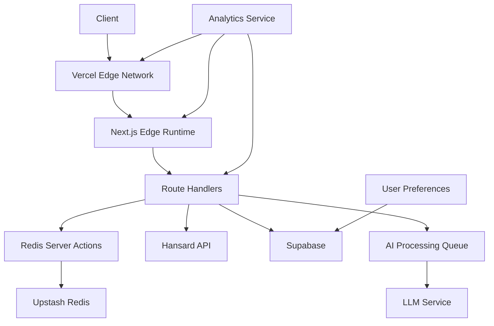

# Parliamentary Debates AI Assistant

## Architecture Overview

The application uses a serverless architecture optimized for Vercel's edge network, combining Hansard API data with AI-generated content stored in Supabase and cached through Upstash Redis. The system supports tiered access and sophisticated AI analysis capabilities.

### Data Flow


## Directory Structure
```
src/
├── app/
│   ├── api/
│   │   └── debates/
│   │       └── route.ts
│   ├── debates/
│   │   └── [id]/
│   │       └── page.tsx
│   ├── search/
│   │   └── page.tsx
│   ├── actions/
│   │   └── redis.ts
│   ├── fonts/
│   │   ├── GeistMonoVF.woff
│   │   └── GeistVF.woff
│   ├── favicon.ico
│   ├── globals.css
│   ├── layout.tsx
│   └── page.tsx
│
├── components/
│   ├── ai/
│   │   ├── AIChat.tsx
│   │   └── MessageForm.tsx
│   ├── auth/
│   │   └── LoginForm.tsx
│   ├── debates/
│   │   ├── DebateFeed.tsx
│   │   └── TopicOverview.tsx
│   ├── nav/
│   │   ├── Navbar.tsx
│   │   └── Sidebar.tsx
│   ├── providers/
│   │   └── QueryProvider.tsx
│   ├── search/
│   │   └── SearchResults.tsx
│   └── ui/
│       ├── avatar.tsx
│       ├── badge.tsx
│       ├── button.tsx
│       ├── calendar.tsx
│       ├── card.tsx
│       ├── command.tsx
│       ├── dialog.tsx
│       ├── dropdown-menu.tsx
│       ├── input.tsx
│       ├── label.tsx
│       ├── select.tsx
│       └── skeleton.tsx
│
├── hooks/
│   ├── useAIChat.ts
│   ├── useAuth.ts
│   ├── useCache.ts
│   ├── useDebateData.ts
│   ├── useDebateSearch.ts
│   └── useDebounce.ts
│
├── lib/
│   ├── redis/
│   │   └── config.ts
│   ├── error.ts
│   ├── hansard-api.ts
│   ├── rate-limit.ts
│   ├── supabase.ts
│   └── utils.ts
│
└── types/
    ├── database.ts
    ├── hansard.ts
    └── index.ts
```

## Core Technologies

### API Integration
- Hansard API for official parliamentary data
- Upstash Redis for caching and rate limiting
- Server Actions for Redis operations
- Supabase for AI-generated content storage

### Frontend
- Next.js 14 (App Router)
- React Server Components
- TypeScript
- Tailwind CSS
- shadcn/ui components
- React Query for client-side data management

### State Management
- Server Components for initial state
- React Query for client-side cache
- Server Actions for Redis operations

## Data Flow

### Hansard API Endpoints
```typescript
// Main endpoints used
const ENDPOINTS = {
  sectionTrees: '/overview/sectiontrees.json',
  debate: '/debates/debate/{debateSectionExtId}.json',
  speakers: '/debates/speakerslist/{debateSectionExtId}.json'
};
```

## Database Schema
```sql
-- Core debates table with minimal required data
CREATE TABLE debates (
  id UUID PRIMARY KEY DEFAULT uuid_generate_v4(),
  ext_id TEXT UNIQUE NOT NULL,
  title TEXT NOT NULL,
  date DATE NOT NULL,
  
  -- Basic metadata
  type TEXT NOT NULL,
  house TEXT NOT NULL,
  location TEXT NOT NULL,
  
  -- AI-generated content
  ai_title TEXT NOT NULL DEFAULT '',
  ai_summary TEXT NOT NULL DEFAULT '',  
  ai_tone TEXT NOT NULL DEFAULT '' CHECK (ai_tone IN ('neutral', 'contentious', 'collaborative')),
  ai_topics JSONB NOT NULL DEFAULT '[]',
  ai_tags JSONB NOT NULL DEFAULT '[]',
  ai_key_points JSONB NOT NULL DEFAULT '[]',
  
  -- Quick stats
  speaker_count INT NOT NULL DEFAULT 0,
  contribution_count INT NOT NULL DEFAULT 0,
  party_count JSONB NOT NULL DEFAULT '{}',
    
  -- Navigation
  parent_ext_id TEXT NOT NULL,
  parent_title TEXT NOT NULL,
  prev_ext_id TEXT,
  next_ext_id TEXT,
  
  -- Search Text
  search_text TEXT,
  
  -- Timestamps
  created_at TIMESTAMPTZ DEFAULT NOW(),
  last_updated TIMESTAMPTZ DEFAULT NOW(),
  
  search_vector tsvector GENERATED ALWAYS AS (
    to_tsvector('english', 
      title || ' ' || 
      COALESCE(ai_summary, '') || ' ' || 
      COALESCE(search_text, '')
    )
  ) STORED
);

CREATE TABLE user_preferences (
  user_id UUID PRIMARY KEY REFERENCES auth.users(id),
  followed_topics TEXT[],
  followed_mps TEXT[],
  notification_settings JSONB,
  feed_preferences JSONB,
  created_at TIMESTAMPTZ DEFAULT NOW(),
  updated_at TIMESTAMPTZ DEFAULT NOW()
);

CREATE TABLE subscriptions (
  id UUID PRIMARY KEY DEFAULT uuid_generate_v4(),
  user_id UUID REFERENCES auth.users(id),
  tier TEXT NOT NULL,
  status TEXT NOT NULL,
  current_period_start TIMESTAMPTZ,
  current_period_end TIMESTAMPTZ,
  created_at TIMESTAMPTZ DEFAULT NOW()
);

-- Indexes
CREATE INDEX idx_debates_ext_id ON debates(ext_id);
CREATE INDEX idx_debates_date ON debates(date DESC);
CREATE INDEX idx_debates_parent ON debates(parent_ext_id);
CREATE INDEX idx_debates_search ON debates USING GIN(search_vector);
```

## Key Features Implementation

## Backend
### 1. Server-side Caching
```typescript
// Redis server actions
export async function getRedisValue<T>(key: string): Promise<T | null> {
  try {
    return await redis.get<T>(key);
  } catch (error) {
    console.error('Redis server error:', error);
    return null;
  }
}
```

### 2. Debate Detail Loading
```typescript
// Parallel loading of all required debate data
export function useDebateDetails(debateSectionExtId: string) {
  return useQueries({
    queries: [
      {
        queryKey: ['debate', debateSectionExtId],
        queryFn: () => HansardAPI.fetchDebate(debateSectionExtId),
      },
      {
        queryKey: ['speakers', debateSectionExtId],
        queryFn: () => HansardAPI.fetchSpeakers(debateSectionExtId),
      },
      {
        queryKey: ['generated', debateSectionExtId],
        queryFn: () => fetchGeneratedContent(debateSectionExtId),
      }
    ],
  });
}
```

##Frontend
### 1. Tiered Access Control
```typescript
export const checkTierAccess = async (
  userId: string,
  feature: TieredFeature
): Promise => {
  const subscription = await getSubscription(userId);
  return hasFeatureAccess(subscription.tier, feature);
};

// Usage in API routes
export async function POST(req: Request) {
  const { userId, feature } = await req.json();
  const hasAccess = await checkTierAccess(userId, feature);
  
  if (!hasAccess) {
    return NextResponse.json(
      { error: 'Upgrade required' },
      { status: 403 }
    );
  }
  // Process request...
}
```

### 2. AI Processing Queue
```typescript
export class AIProcessingQueue {
  async addToQueue(task: AITask): Promise {
    const taskId = uuidv4();
    await redis.set(`ai:task:${taskId}`, {
      ...task,
      status: 'pending',
      created: Date.now()
    });
    await this.processQueue();
    return taskId;
  }

  private async processQueue() {
    // Process tasks based on user tier priority
    const tasks = await this.getPendingTasks();
    for (const task of tasks) {
      if (await this.canProcess(task)) {
        await this.processTask(task);
      }
    }
  }
}
```

### 3. Personalized Feed
```typescript
export async function getPersonalizedFeed(
  userId: string,
  page: number
): Promise {
  const preferences = await getUserPreferences(userId);
  const debates = await getRecentDebates();
  
  return debates
    .filter(debate => matchesPreferences(debate, preferences))
    .slice((page - 1) * 20, page * 20);
}
```


## Performance Optimizations

### 1. Data Fetching
- Edge-cached responses
- Incremental Static Regeneration (ISR)
- Parallel API requests
- Selective loading of debate content
- Server-side Redis caching
- Client-side React Query caching
- Parallel data loading
- Rate limiting with Upstash

### 2. Rendering
- Virtualized list for long debates
- Memoized components
- Lazy loading of AI features
- Optimized re-renders

### 3a. Caching Strategy
- Server-side Redis caching through server actions
- Client-side React Query for state management
- API route caching with TTL
- Fallback to direct API calls on cache miss
```typescript
const queryClient = new QueryClient({
  defaultOptions: {
    queries: {
      staleTime: 1000 * 60 * 5, // Data fresh for 5 minutes
      cacheTime: 1000 * 60 * 30, // Cache persists for 30 minutes
      refetchOnWindowFocus: false,
      retry: 2,
    },
  },
});
```

### 3b. Tier-based Caching
```typescript
const CACHE_TIMES = {
  free: 3600,        // 1 hour
  premium: 1800,     // 30 minutes
  professional: 300   // 5 minutes
};

export async function getCachedContent(
  key: string,
  tier: SubscriptionTier
): Promise {
  const cached = await redis.get(key);
  if (cached && Date.now() - cached.timestamp < CACHE_TIMES[tier]) {
    return cached.data;
  }
  return null;
}
```

### Caching Implementation
```typescript
// Server-side Redis actions
export async function getRedisValue<T>(key: string): Promise<T | null> {
  try {
    return await redis.get<T>(key);
  } catch (error) {
    console.error('Redis server error:', error);
    return null;
  }
}

// API route caching pattern
export async function GET() {
  const cacheKey = `debates:${today}`;
  try {
    const cachedData = await getRedisValue(cacheKey);
    if (cachedData) return NextResponse.json(cachedData);
    
    // Fetch and cache fresh data
    const debates = await HansardAPI.getDebatesList(today);
    await setRedisValue(cacheKey, debates, 3600);
    return NextResponse.json(debates);
  } catch (error) {
    return NextResponse.json(
      { error: 'Service unavailable' }, 
      { status: 503 }
    );
  }
}
```

## Setup Instructions

1. Environment Configuration
```bash
# .env.local
NEXT_PUBLIC_SUPABASE_URL=your_supabase_url
NEXT_PUBLIC_SUPABASE_ANON_KEY=your_supabase_anon_key
UPSTASH_REDIS_REST_URL=your_upstash_url
UPSTASH_REDIS_REST_TOKEN=your_upstash_token
```

2. Install Dependencies
```bash
npm install @vercel/analytics @upstash/redis @upstash/ratelimit
```

3. Initialize Supabase Tables
```bash
# Run database migrations in Supabase dashboard
npm run supabase:migrations
```

## Error Handling

1. API Error Boundaries
```typescript
// Implementation of error boundaries for API failures
<ErrorBoundary fallback={<DebateErrorState />}>
  <DebateView debateSectionExtId={id} />
</ErrorBoundary>
```

2. Loading States
```typescript
// Skeleton loading states during data fetching
<Suspense fallback={<DebateSkeleton />}>
  <DebateContent />
</Suspense>
```

## Monitoring & Analytics

1. Performance Metrics
- Time to First Contentful Paint (FCP)
- Largest Contentful Paint (LCP)
- First Input Delay (FID)
- Cumulative Layout Shift (CLS)

2. Error Tracking
- API failure rates
- Data loading success rates
- UI interaction errors

## Security Considerations

1. API Security
- Rate limiting on API requests
- Authentication for generated content
- Input validation

2. Data Protection
- Secure storage of generated content
- User session management
- XSS prevention

## Deployment

### Production Build
```bash
npm run build
```

### Runtime Requirements
- Node.js 18+
- Memory: 512MB minimum
- Storage: 1GB minimum

### Infrastructure
- Vercel for frontend hosting
- Supabase for database

For detailed API documentation and test coverage information, refer to the inline documentation in the codebase.