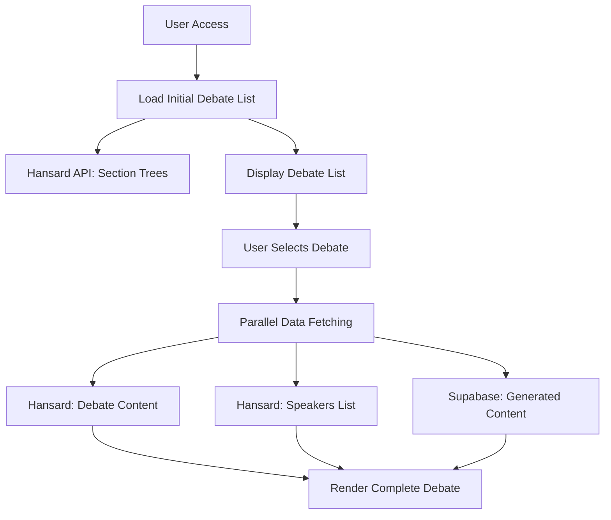

# Parliamentary Debates AI Assistant

## Architecture Overview

The application uses a hybrid data approach, combining live Hansard API data with supplementary AI-generated content stored in Supabase.

### Data Flow


## Directory Structure
```
parliamentary-debates/
├── src/
│   ├── components/
│   │   ├── ai/
│   │   │   ├── AIChat.tsx
│   │   │   └── MessageForm.tsx
│   │   ├── auth/
│   │   │   └── LoginForm.tsx
│   │   ├── debates/
│   │   │   ├── DebateList.tsx      # Shows overview of debates
│   │   │   ├── DebateView.tsx      # Main debate viewing component
│   │   │   ├── DebateContent.tsx   # Renders debate contributions
│   │   │   ├── DebateItem.tsx      # Individual contribution component
│   │   │   ├── DebateHeader.tsx    # Debate metadata and controls
│   │   │   └── DebateSkeleton.tsx  # Loading states
│   │   └── layout/
│   │       ├── Header.tsx
│   │       ├── Layout.tsx
│   │       └── Sidebar.tsx
│   ├── hooks/
│   │   ├── useDebateData.ts        # Hansard API integration
│   │   ├── useAIChat.ts            # AI chat functionality
│   │   └── useAuth.ts              # Authentication
│   ├── lib/
│   │   ├── hansard-api.ts          # Hansard API client
│   │   ├── supabase.ts             # Supabase client
│   │   └── utils.ts
│   └── types/
│       ├── hansard.ts              # Hansard API types
│       └── database.ts             # Supabase types
```

## Core Technologies

### API Integration
- Hansard API for official parliamentary data
- tRPC for type-safe API routes
- Supabase for AI-generated content storage

### Frontend
- Next.js 14
- React 18
- TypeScript
- Tailwind CSS
- shadcn/ui components

### State Management
- Jotai for global state
- React Context for auth state

## Data Sources

### Hansard API Endpoints
```typescript
// Main endpoints used
const ENDPOINTS = {
  sectionTrees: '/overview/sectiontrees.json',
  debate: '/debates/debate/{debateSectionExtId}.json',
  speakers: '/debates/speakerslist/{debateSectionExtId}.json'
};
```

### Database Schema
```sql
-- Supabase Schema
CREATE TABLE debate_generated_content (
  id UUID PRIMARY KEY DEFAULT uuid_generate_v4(),
  debate_section_ext_id TEXT NOT NULL,
  original_contribution_id TEXT NOT NULL,
  content TEXT NOT NULL,
  metadata JSONB DEFAULT '{}',
  created_at TIMESTAMPTZ DEFAULT NOW()
);

-- Indexes
CREATE INDEX idx_debate_generated_debate_section 
  ON debate_generated_content(debate_section_ext_id);
CREATE INDEX idx_debate_generated_contribution 
  ON debate_generated_content(original_contribution_id);
```

## Key Features Implementation

### 1. Debate List Loading
```typescript
// Initial data load using tRPC
export function useDebatesList() {
  const [filters] = useAtom(filterAtom);
  return trpc.debates.list.useQuery({ 
    filters,
    skip: 0,
    take: 20
  });
}
```

### 2. Debate Detail Loading
```typescript
// Parallel loading of all required debate data
export function useDebateDetails(debateSectionExtId: string) {
  return useQueries({
    queries: [
      {
        queryKey: ['debate', debateSectionExtId],
        queryFn: () => HansardAPI.fetchDebate(debateSectionExtId),
      },
      {
        queryKey: ['speakers', debateSectionExtId],
        queryFn: () => HansardAPI.fetchSpeakers(debateSectionExtId),
      },
      {
        queryKey: ['generated', debateSectionExtId],
        queryFn: () => fetchGeneratedContent(debateSectionExtId),
      }
    ],
  });
}
```

## Performance Optimizations

### 1. Data Fetching
- Parallel API requests
- Query caching with React Query
- Selective loading of debate content
- Debounced search operations

### 2. Rendering
- Virtualized list for long debates
- Memoized components
- Lazy loading of AI features
- Optimized re-renders

### 3. Caching Strategy
```typescript
const queryClient = new QueryClient({
  defaultOptions: {
    queries: {
      staleTime: 1000 * 60 * 5, // Data fresh for 5 minutes
      cacheTime: 1000 * 60 * 30, // Cache persists for 30 minutes
      refetchOnWindowFocus: false,
      retry: 2,
    },
  },
});
```

## Setup Instructions

1. Environment Configuration
```bash
# .env.local
NEXT_PUBLIC_HANSARD_API_URL=https://hansard-api.parliament.uk
NEXT_PUBLIC_SUPABASE_URL=your_supabase_url
NEXT_PUBLIC_SUPABASE_ANON_KEY=your_supabase_anon_key
```

2. Install Dependencies
```bash
npm install @tanstack/react-query @supabase/supabase-js
```

3. Initialize Supabase Tables
```bash
# Run database migrations in Supabase dashboard
npm run supabase:migrations
```

## Error Handling

1. API Error Boundaries
```typescript
// Implementation of error boundaries for API failures
<ErrorBoundary fallback={<DebateErrorState />}>
  <DebateView debateSectionExtId={id} />
</ErrorBoundary>
```

2. Loading States
```typescript
// Skeleton loading states during data fetching
<Suspense fallback={<DebateSkeleton />}>
  <DebateContent />
</Suspense>
```

## Monitoring & Analytics

1. Performance Metrics
- Time to First Contentful Paint (FCP)
- Largest Contentful Paint (LCP)
- First Input Delay (FID)
- Cumulative Layout Shift (CLS)

2. Error Tracking
- API failure rates
- Data loading success rates
- UI interaction errors

## Security Considerations

1. API Security
- Rate limiting on API requests
- Authentication for generated content
- Input validation

2. Data Protection
- Secure storage of generated content
- User session management
- XSS prevention

## Deployment

### Production Build
```bash
npm run build
```

### Runtime Requirements
- Node.js 18+
- Memory: 512MB minimum
- Storage: 1GB minimum

### Infrastructure
- Vercel for frontend hosting
- Supabase for database
- Redis for caching (optional)

For detailed API documentation and test coverage information, refer to the inline documentation in the codebase.